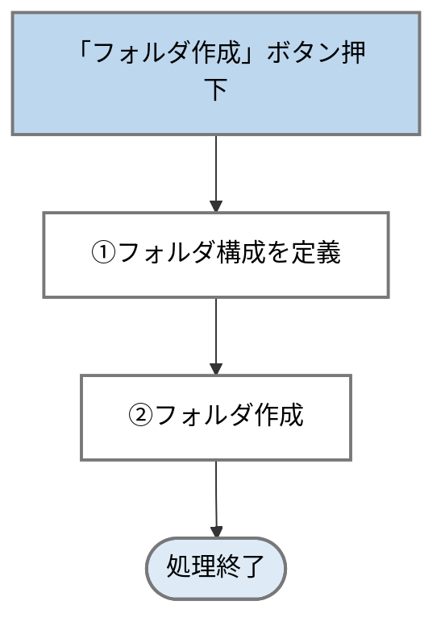
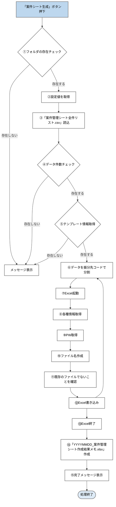
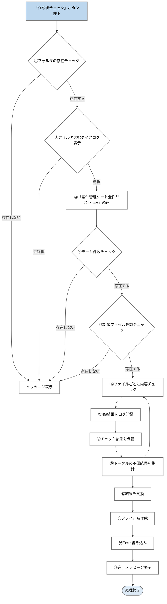
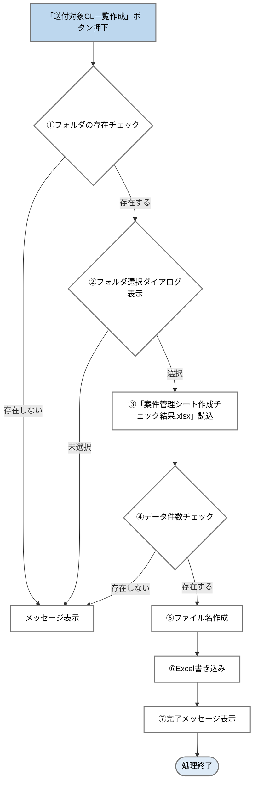
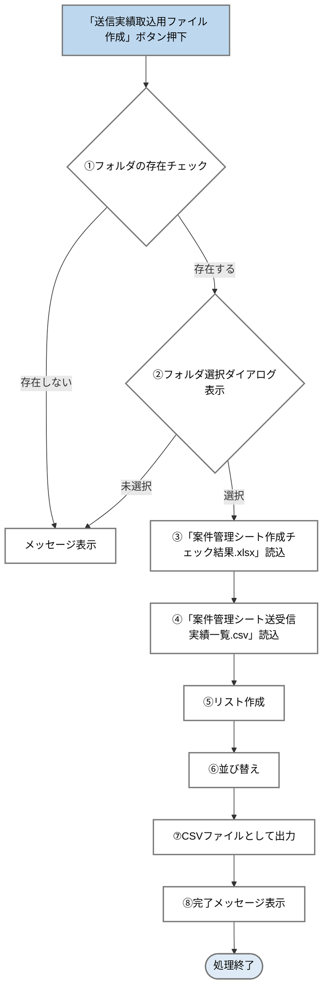

タブ1
フォルダ作成

```mermaid
flowchart TB
    A[「フォルダ作成」ボタン押下] --> B[①フォルダ構成を定義] --> C[②フォルダ作成] --> D([処理終了])

    style A fill:#BDD7EE,stroke:#787878,stroke-width:2px,color:#000000
    style B fill:#FFFFFF,stroke:#787878,stroke-width:2px,color:#000000
    style C fill:#FFFFFF,stroke:#787878,stroke-width:2px,color:#000000
    style D fill:#DEEBF7,stroke:#787878,stroke-width:2px,color:#000000
```

案件管理シート作成

```mermaid
flowchart TB
    A[「案件シート生成」ボタン押下] --> 
    B{①フォルダの存在チェック} -- 存在しない --> C[メッセージ表示]
    B{①フォルダの存在チェック} -- 存在する --> D[②設定値を取得] --> E[③「案件管理シート全件リスト.csv」読込] --> 
    F{④データ件数チェック} -- 存在しない --> C[メッセージ表示]
    F{④データ件数チェック} -- 存在する --> G{⑤テンプレート情報取得} -- 存在しない --> C[メッセージ表示]
    G{⑤テンプレート情報取得} -- 存在する --> H[⑥データを振分先コードで分割] --> I[⑦Excel起動] --> 
    J[⑧各種情報取得] --> K[⑨PW取得] --> L[⑩ファイル名作成] --> M[⑪既存のファイルでないことを確認] --> 
    N[⑫Excel書き込み] --> H[⑥データを振分先コードで分割]
    N[⑫Excel書き込み] --> O[⑬Excel終了] --> P[⑭「YYYYMMDD_案件管理シート作成結果メモ.xlsx」作成] --> 
    Q[⑮完了メッセージ表示] --> R([処理終了])

    style A fill:#BDD7EE,stroke:#787878,stroke-width:2px,color:#000000
    style B fill:#FFFFFF,stroke:#787878,stroke-width:2px,color:#000000
    style C fill:#FFFFFF,stroke:#787878,stroke-width:2px,color:#000000
    style D fill:#FFFFFF,stroke:#787878,stroke-width:2px,color:#000000
    style E fill:#FFFFFF,stroke:#787878,stroke-width:2px,color:#000000
    style F fill:#FFFFFF,stroke:#787878,stroke-width:2px,color:#000000
    style G fill:#FFFFFF,stroke:#787878,stroke-width:2px,color:#000000
    style H fill:#FFFFFF,stroke:#787878,stroke-width:2px,color:#000000
    style I fill:#FFFFFF,stroke:#787878,stroke-width:2px,color:#000000
    style J fill:#FFFFFF,stroke:#787878,stroke-width:2px,color:#000000
    style K fill:#FFFFFF,stroke:#787878,stroke-width:2px,color:#000000
    style L fill:#FFFFFF,stroke:#787878,stroke-width:2px,color:#000000
    style M fill:#FFFFFF,stroke:#787878,stroke-width:2px,color:#000000
    style N fill:#FFFFFF,stroke:#787878,stroke-width:2px,color:#000000
    style O fill:#FFFFFF,stroke:#787878,stroke-width:2px,color:#000000
    style P fill:#FFFFFF,stroke:#787878,stroke-width:2px,color:#000000
    style Q fill:#FFFFFF,stroke:#787878,stroke-width:2px,color:#000000
    style R fill:#DEEBF7,stroke:#787878,stroke-width:2px,color:#000000
```

整合性チェック

```mermaid
flowchart TB
    A[「作成後チェック」ボタン押下] --> 
    B{①フォルダの存在チェック} -- 存在しない --> C[メッセージ表示]
    B{①フォルダの存在チェック} -- 存在する --> 
    D{②フォルダ選択ダイアログ表示} -- 未選択 --> C[メッセージ表示]
    D{②フォルダ選択ダイアログ表示} -- 選択 --> E[③「案件管理シート全件リスト.csv」読込] --> 
    F{④データ件数チェック} -- 存在しない --> C[メッセージ表示]
    F{④データ件数チェック} -- 存在する --> G{⑤対象ファイル件数チェック} -- 存在しない --> C[メッセージ表示]
    G{⑤対象ファイル件数チェック} -- 存在する --> H[⑥ファイルごとに内容チェック] --> I[⑦NG結果をログ記録] --> 
    J[⑧チェック結果を保管] --> K[⑨トータルの不備結果を集計] --> H[⑥ファイルごとに内容チェック]
    K[⑨トータルの不備結果を集計] --> L[⑩結果を変換] --> M[⑪ファイル名作成] --> 
    N[⑫Excel書き込み] --> O[⑬完了メッセージ表示] --> 
    P([処理終了])

    style A fill:#BDD7EE,stroke:#787878,stroke-width:2px,color:#000000
    style B fill:#FFFFFF,stroke:#787878,stroke-width:2px,color:#000000
    style C fill:#FFFFFF,stroke:#787878,stroke-width:2px,color:#000000
    style D fill:#FFFFFF,stroke:#787878,stroke-width:2px,color:#000000
    style E fill:#FFFFFF,stroke:#787878,stroke-width:2px,color:#000000
    style F fill:#FFFFFF,stroke:#787878,stroke-width:2px,color:#000000
    style G fill:#FFFFFF,stroke:#787878,stroke-width:2px,color:#000000
    style H fill:#FFFFFF,stroke:#787878,stroke-width:2px,color:#000000
    style I fill:#FFFFFF,stroke:#787878,stroke-width:2px,color:#000000
    style J fill:#FFFFFF,stroke:#787878,stroke-width:2px,color:#000000
    style K fill:#FFFFFF,stroke:#787878,stroke-width:2px,color:#000000
    style L fill:#FFFFFF,stroke:#787878,stroke-width:2px,color:#000000
    style M fill:#FFFFFF,stroke:#787878,stroke-width:2px,color:#000000
    style N fill:#FFFFFF,stroke:#787878,stroke-width:2px,color:#000000
    style O fill:#FFFFFF,stroke:#787878,stroke-width:2px,color:#000000
    style P fill:#DEEBF7,stroke:#787878,stroke-width:2px,color:#000000
```

送付対象リスト出力

```mermaid
flowchart TB
    A[「送付対象CL一覧作成」ボタン押下] --> 
    B{①フォルダの存在チェック} -- 存在しない --> C[メッセージ表示]
    B{①フォルダの存在チェック} -- 存在する --> 
    D{②フォルダ選択ダイアログ表示} -- 未選択 --> C[メッセージ表示]
    D{②フォルダ選択ダイアログ表示} -- 選択 --> E[③「案件管理シート作成チェック結果.xlsx」読込] --> 
    F{④データ件数チェック} -- 存在しない --> C[メッセージ表示]
    F{④データ件数チェック} -- 存在する --> G[⑤ファイル名作成] --> H[⑥Excel書き込み] --> I[⑦完了メッセージ表示] --> 
    J([処理終了])

    style A fill:#BDD7EE,stroke:#787878,stroke-width:2px,color:#000000
    style B fill:#FFFFFF,stroke:#787878,stroke-width:2px,color:#000000
    style C fill:#FFFFFF,stroke:#787878,stroke-width:2px,color:#000000
    style D fill:#FFFFFF,stroke:#787878,stroke-width:2px,color:#000000
    style E fill:#FFFFFF,stroke:#787878,stroke-width:2px,color:#000000
    style F fill:#FFFFFF,stroke:#787878,stroke-width:2px,color:#000000
    style G fill:#FFFFFF,stroke:#787878,stroke-width:2px,color:#000000
    style H fill:#FFFFFF,stroke:#787878,stroke-width:2px,color:#000000
    style I fill:#FFFFFF,stroke:#787878,stroke-width:2px,color:#000000
    style J fill:#DEEBF7,stroke:#787878,stroke-width:2px,color:#000000
```

送信実績取込用ファイル作成

```mermaid
flowchart TB
    A[「送信実績取込用ファイル作成」ボタン押下] --> 
    B{①フォルダの存在チェック} -- 存在しない --> C[メッセージ表示]
    B{①フォルダの存在チェック} -- 存在する --> 
    D{②フォルダ選択ダイアログ表示} -- 未選択 --> C[メッセージ表示]
    D{②フォルダ選択ダイアログ表示} -- 選択 --> E[③「案件管理シート作成チェック結果.xlsx」読込] --> 
    F[④「案件管理シート送受信実績一覧.csv」読込] --> G[⑤リスト作成] --> H[⑥並び替え] --> I[⑦CSVファイルとして出力] --> 
    J[⑧完了メッセージ表示] --> 
    K([処理終了])

    style A fill:#BDD7EE,stroke:#787878,stroke-width:2px,color:#000000
    style B fill:#FFFFFF,stroke:#787878,stroke-width:2px,color:#000000
    style C fill:#FFFFFF,stroke:#787878,stroke-width:2px,color:#000000
    style D fill:#FFFFFF,stroke:#787878,stroke-width:2px,color:#000000
    style E fill:#FFFFFF,stroke:#787878,stroke-width:2px,color:#000000
    style F fill:#FFFFFF,stroke:#787878,stroke-width:2px,color:#000000
    style G fill:#FFFFFF,stroke:#787878,stroke-width:2px,color:#000000
    style H fill:#FFFFFF,stroke:#787878,stroke-width:2px,color:#000000
    style I fill:#FFFFFF,stroke:#787878,stroke-width:2px,color:#000000
    style J fill:#FFFFFF,stroke:#787878,stroke-width:2px,color:#000000
    style K fill:#DEEBF7,stroke:#787878,stroke-width:2px,color:#000000
```