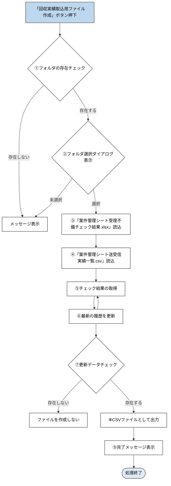
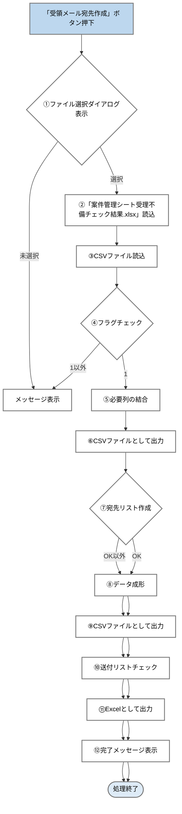
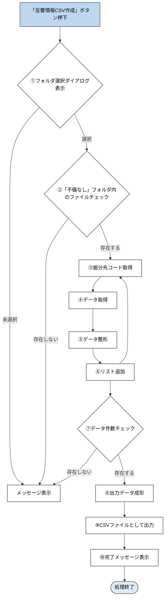

タブ2
不意チェック実行

```mermaid
flowchart TB
    A[「不備チェック実行」ボタン押下] --> 
    B{①フォルダの存在チェック} -- 存在しない --> C[メッセージ表示]
    B{①フォルダの存在チェック} -- 存在する --> 
    D{②「■チェック前案件管理シート格納」フォルダ内のファイルパスを取得} -- 存在しない --> C[メッセージ表示]
    D{②「■チェック前案件管理シート格納」フォルダ内のファイルパスを取得} -- 存在する --> 
    E[③「案件管理シート送付先リスト.csv」読込] --> 
    F[④ファイルごとに内容チェック] --> G[⑤NG結果をログ記録] --> H[⑥チェック結果を保管] --> 
    I[⑦トータルの不備結果を集計] --> J[⑧不備メッセージ取得] --> 
    K[⑨Falseがあった項目のメッセージを抽出] --> L{⑩不備内容「不備あり時」1に値を設定} -- 存在しない --> M[空を設定] --> 
    N{⑪不備内容「不備あり時」2に値を設定} -- 6以上存在しない --> M[空を設定] --> O[⑫ファイル移動]
    L{⑩不備内容「不備あり時」1に値を設定} -- 存在する --> N{⑪不備内容「不備あり時」2に値を設定} -- 6以上存在する --> O[⑫ファイル移動] --> 
    F[④ファイルごとに内容チェック]
    O[⑫ファイル移動] --> P[⑬結果を変換] --> Q[⑭ファイル名作成] --> 
    R[⑮Excel書き込み] --> S[⑯完了メッセージ表示] --> 
    T([処理終了])
  

    style A fill:#BDD7EE,stroke:#787878,stroke-width:2px,color:#000000
    style B fill:#FFFFFF,stroke:#787878,stroke-width:2px,color:#000000
    style C fill:#FFFFFF,stroke:#787878,stroke-width:2px,color:#000000
    style D fill:#FFFFFF,stroke:#787878,stroke-width:2px,color:#000000
    style E fill:#FFFFFF,stroke:#787878,stroke-width:2px,color:#000000
    style F fill:#FFFFFF,stroke:#787878,stroke-width:2px,color:#000000
    style G fill:#FFFFFF,stroke:#787878,stroke-width:2px,color:#000000
    style H fill:#FFFFFF,stroke:#787878,stroke-width:2px,color:#000000
    style I fill:#FFFFFF,stroke:#787878,stroke-width:2px,color:#000000
    style J fill:#FFFFFF,stroke:#787878,stroke-width:2px,color:#000000
    style K fill:#FFFFFF,stroke:#787878,stroke-width:2px,color:#000000
    style L fill:#FFFFFF,stroke:#787878,stroke-width:2px,color:#000000
    style M fill:#FFFFFF,stroke:#787878,stroke-width:2px,color:#000000
    style N fill:#FFFFFF,stroke:#787878,stroke-width:2px,color:#000000
    style O fill:#FFFFFF,stroke:#787878,stroke-width:2px,color:#000000
    style P fill:#FFFFFF,stroke:#787878,stroke-width:2px,color:#000000
    style Q fill:#FFFFFF,stroke:#787878,stroke-width:2px,color:#000000
    style R fill:#FFFFFF,stroke:#787878,stroke-width:2px,color:#000000
    style S fill:#FFFFFF,stroke:#787878,stroke-width:2px,color:#000000
    style T fill:#DEEBF7,stroke:#787878,stroke-width:2px,color:#000000
```

回収実績取込用ファイル作成

```mermaid
flowchart TB
    A[「回収実績取込用ファイル作成」ボタン押下] --> 
    B{①フォルダの存在チェック} -- 存在しない --> C[メッセージ表示]
    B{①フォルダの存在チェック} -- 存在する --> 
    D{②フォルダ選択ダイアログ表示} -- 未選択 --> C[メッセージ表示]
    D{②フォルダ選択ダイアログ表示} -- 選択 --> E[③「案件管理シート受理不備チェック結果.xlsx」読込] --> 
    F[④「案件管理シート送受信実績一覧.csv」読込] --> G[⑤チェック結果の取得] --> H[⑥最新の履歴を更新] --> G[⑤チェック結果の取得]
    H[⑥最新の履歴を更新] --> I{⑦更新データチェック} -- 存在しない --> J[ファイルを作成しない]
    I{⑦更新データチェック} -- 存在する --> K[⑧CSVファイルとして出力] --> 
    L[⑨完了メッセージ表示] --> 
    M([処理終了])

    style A fill:#BDD7EE,stroke:#787878,stroke-width:2px,color:#000000
    style B fill:#FFFFFF,stroke:#787878,stroke-width:2px,color:#000000
    style C fill:#FFFFFF,stroke:#787878,stroke-width:2px,color:#000000
    style D fill:#FFFFFF,stroke:#787878,stroke-width:2px,color:#000000
    style E fill:#FFFFFF,stroke:#787878,stroke-width:2px,color:#000000
    style F fill:#FFFFFF,stroke:#787878,stroke-width:2px,color:#000000
    style G fill:#FFFFFF,stroke:#787878,stroke-width:2px,color:#000000
    style H fill:#FFFFFF,stroke:#787878,stroke-width:2px,color:#000000
    style I fill:#FFFFFF,stroke:#787878,stroke-width:2px,color:#000000
    style J fill:#FFFFFF,stroke:#787878,stroke-width:2px,color:#000000
    style K fill:#FFFFFF,stroke:#787878,stroke-width:2px,color:#000000
    style L fill:#FFFFFF,stroke:#787878,stroke-width:2px,color:#000000
    style M fill:#DEEBF7,stroke:#787878,stroke-width:2px,color:#000000
```

CLへの受領メール宛先作成

```mermaid
flowchart TB
    A[「受領メール宛先作成」ボタン押下] --> 
    B{①ファイル選択ダイアログ表示} -- 未選択 --> C[メッセージ表示]
    B{①ファイル選択ダイアログ表示} -- 選択 --> 
    D[②「案件管理シート受理不備チェック結果.xlsx」読込] --> E[③CSVファイル読込] --> 
    F{④フラグチェック} -- 1以外 --> C[メッセージ表示]
    F{④フラグチェック} -- 1 --> G[⑤必要列の結合] --> 
    H[⑥CSVファイルとして出力] --> 
    I{⑦宛先リスト作成} -- OK以外 --> J[⑧データ成形] --> K[⑨CSVファイルとして出力] --> L[⑩送付リストチェック] --> M[⑪Excelとして出力] --> 
    N[⑫完了メッセージ表示] --> 
    O([処理終了])
    I{⑦宛先リスト作成} -- OK --> J[⑧データ成形] --> K[⑨CSVファイルとして出力] --> L[⑩送付リストチェック] --> M[⑪Excelとして出力] --> 
    N[⑫完了メッセージ表示] --> 
    O([処理終了])

    style A fill:#BDD7EE,stroke:#787878,stroke-width:2px,color:#000000
    style B fill:#FFFFFF,stroke:#787878,stroke-width:2px,color:#000000
    style C fill:#FFFFFF,stroke:#787878,stroke-width:2px,color:#000000
    style D fill:#FFFFFF,stroke:#787878,stroke-width:2px,color:#000000
    style E fill:#FFFFFF,stroke:#787878,stroke-width:2px,color:#000000
    style F fill:#FFFFFF,stroke:#787878,stroke-width:2px,color:#000000
    style G fill:#FFFFFF,stroke:#787878,stroke-width:2px,color:#000000
    style H fill:#FFFFFF,stroke:#787878,stroke-width:2px,color:#000000
    style I fill:#FFFFFF,stroke:#787878,stroke-width:2px,color:#000000
    style J fill:#FFFFFF,stroke:#787878,stroke-width:2px,color:#000000
    style K fill:#FFFFFF,stroke:#787878,stroke-width:2px,color:#000000
    style L fill:#FFFFFF,stroke:#787878,stroke-width:2px,color:#000000
    style M fill:#FFFFFF,stroke:#787878,stroke-width:2px,color:#000000
    style N fill:#FFFFFF,stroke:#787878,stroke-width:2px,color:#000000
    style O fill:#DEEBF7,stroke:#787878,stroke-width:2px,color:#000000
```

反響内容取込用ファイル作成

```mermaid
flowchart TB
    A[「反響情報CSV作成」ボタン押下] --> 
    B{①フォルダ選択ダイアログ表示} -- 未選択 --> C[メッセージ表示]
    B{①フォルダ選択ダイアログ表示} -- 選択 --> 
    D{②「不備なし」フォルダ内のファイルチェック} -- 存在しない --> C[メッセージ表示]
    D{②「不備なし」フォルダ内のファイルチェック} -- 存在する --> E[③振分先コード取得] --> 
    F[④データ取得] --> G[⑤データ整形] --> H[⑥リスト追加] --> E[③振分先コード取得]
    H[⑥リスト追加] --> I{⑦データ件数チェック} -- 存在しない --> C[メッセージ表示]
    I{⑦データ件数チェック} -- 存在する --> J[⑧出力データ成形] --> K[⑨CSVファイルとして出力]  --> L[⑩完了メッセージ表示]  --> 
    M([処理終了])

    style A fill:#BDD7EE,stroke:#787878,stroke-width:2px,color:#000000
    style B fill:#FFFFFF,stroke:#787878,stroke-width:2px,color:#000000
    style C fill:#FFFFFF,stroke:#787878,stroke-width:2px,color:#000000
    style D fill:#FFFFFF,stroke:#787878,stroke-width:2px,color:#000000
    style E fill:#FFFFFF,stroke:#787878,stroke-width:2px,color:#000000
    style F fill:#FFFFFF,stroke:#787878,stroke-width:2px,color:#000000
    style G fill:#FFFFFF,stroke:#787878,stroke-width:2px,color:#000000
    style H fill:#FFFFFF,stroke:#787878,stroke-width:2px,color:#000000
    style I fill:#FFFFFF,stroke:#787878,stroke-width:2px,color:#000000
    style J fill:#FFFFFF,stroke:#787878,stroke-width:2px,color:#000000
    style K fill:#FFFFFF,stroke:#787878,stroke-width:2px,color:#000000
    style L fill:#FFFFFF,stroke:#787878,stroke-width:2px,color:#000000
    style M fill:#DEEBF7,stroke:#787878,stroke-width:2px,color:#000000
```