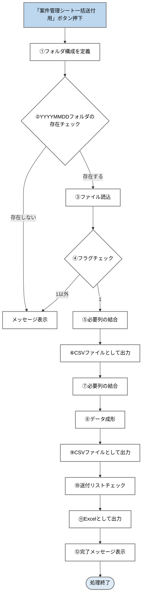
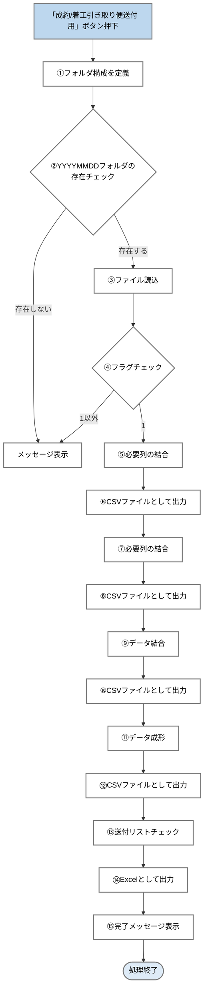
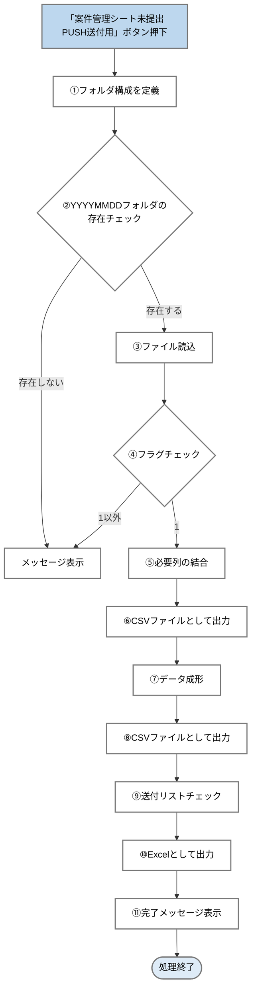
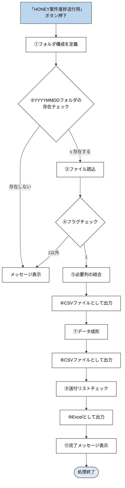

タブ3
案件管理シートの一括送付

```mermaid
flowchart TB
    A[「案件管理シート一括送付用」ボタン押下] --> 
    B[①フォルダ構成を定義] --> 
    C{②YYYYMMDDフォルダの存在チェック} -- 存在しない --> D[メッセージ表示]
    C{②YYYYMMDDフォルダの存在チェック} -- 存在する --> E[③ファイル読込] --> 
    F{④フラグチェック} -- 1以外 --> D[メッセージ表示]
    F{④フラグチェック} -- 1 --> G[⑤必要列の結合] -->  H[⑥CSVファイルとして出力] --> 
    I[⑦必要列の結合] --> J[⑧データ成形] --> K[⑨CSVファイルとして出力] --> L[⑩送付リストチェック] --> M[⑪Excelとして出力] --> 
    N[⑫完了メッセージ表示]  --> 
    O([処理終了])
  

    style A fill:#BDD7EE,stroke:#787878,stroke-width:2px,color:#000000
    style B fill:#FFFFFF,stroke:#787878,stroke-width:2px,color:#000000
    style C fill:#FFFFFF,stroke:#787878,stroke-width:2px,color:#000000
    style D fill:#FFFFFF,stroke:#787878,stroke-width:2px,color:#000000
    style E fill:#FFFFFF,stroke:#787878,stroke-width:2px,color:#000000
    style F fill:#FFFFFF,stroke:#787878,stroke-width:2px,color:#000000
    style G fill:#FFFFFF,stroke:#787878,stroke-width:2px,color:#000000
    style H fill:#FFFFFF,stroke:#787878,stroke-width:2px,color:#000000
    style I fill:#FFFFFF,stroke:#787878,stroke-width:2px,color:#000000
    style J fill:#FFFFFF,stroke:#787878,stroke-width:2px,color:#000000
    style K fill:#FFFFFF,stroke:#787878,stroke-width:2px,color:#000000
    style L fill:#FFFFFF,stroke:#787878,stroke-width:2px,color:#000000
    style M fill:#FFFFFF,stroke:#787878,stroke-width:2px,color:#000000
    style N fill:#FFFFFF,stroke:#787878,stroke-width:2px,color:#000000
    style O fill:#DEEBF7,stroke:#787878,stroke-width:2px,color:#000000
```

成約確認書・着工証跡引き取り便送付

```mermaid
flowchart TB
    A[「成約/着工引き取り便送付用」ボタン押下] --> 
    B[①フォルダ構成を定義] --> 
    C{②YYYYMMDDフォルダの存在チェック} -- 存在しない --> D[メッセージ表示]
    C{②YYYYMMDDフォルダの存在チェック} -- 存在する --> E[③ファイル読込] --> 
    F{④フラグチェック} -- 1以外 --> D[メッセージ表示]
    F{④フラグチェック} -- 1 --> G[⑤必要列の結合] -->  H[⑥CSVファイルとして出力] --> 
    I[⑦必要列の結合] --> J[⑧CSVファイルとして出力] --> K[⑨データ結合] --> L[⑩CSVファイルとして出力] --> M[⑪データ成形] --> 
    N[⑫CSVファイルとして出力]  --> O[⑬送付リストチェック] --> P[⑭Excelとして出力] --> Q[⑮完了メッセージ表示] --> 
    R([処理終了])
  

    style A fill:#BDD7EE,stroke:#787878,stroke-width:2px,color:#000000
    style B fill:#FFFFFF,stroke:#787878,stroke-width:2px,color:#000000
    style C fill:#FFFFFF,stroke:#787878,stroke-width:2px,color:#000000
    style D fill:#FFFFFF,stroke:#787878,stroke-width:2px,color:#000000
    style E fill:#FFFFFF,stroke:#787878,stroke-width:2px,color:#000000
    style F fill:#FFFFFF,stroke:#787878,stroke-width:2px,color:#000000
    style G fill:#FFFFFF,stroke:#787878,stroke-width:2px,color:#000000
    style H fill:#FFFFFF,stroke:#787878,stroke-width:2px,color:#000000
    style I fill:#FFFFFF,stroke:#787878,stroke-width:2px,color:#000000
    style J fill:#FFFFFF,stroke:#787878,stroke-width:2px,color:#000000
    style K fill:#FFFFFF,stroke:#787878,stroke-width:2px,color:#000000
    style L fill:#FFFFFF,stroke:#787878,stroke-width:2px,color:#000000
    style M fill:#FFFFFF,stroke:#787878,stroke-width:2px,color:#000000
    style N fill:#FFFFFF,stroke:#787878,stroke-width:2px,color:#000000
    style O fill:#FFFFFF,stroke:#787878,stroke-width:2px,color:#000000
    style P fill:#FFFFFF,stroke:#787878,stroke-width:2px,color:#000000
    style Q fill:#FFFFFF,stroke:#787878,stroke-width:2px,color:#000000
    style R fill:#DEEBF7,stroke:#787878,stroke-width:2px,color:#000000
```

個別着工証跡引き取り便送付

```mermaid
flowchart TB
    A[「個別着工引き取り便送付用」ボタン押下] --> 
    B[①フォルダ構成を定義] --> 
    C{②YYYYMMDDフォルダの存在チェック} -- 存在しない --> D[メッセージ表示]
    C{②YYYYMMDDフォルダの存在チェック} -- 存在する --> E[③ファイル読込] --> 
    F[④テンプレート情報取得] --> G[⑤現在年月取得] -->  H[⑥着工報告ファイル作成] --> 
    I[⑦出力用データフレーム作成] --> J[⑧CSVファイルとして出力] --> K[⑨送付リストチェック] --> L[⑩Excelとして出力] --> M[⑪必要列の追加] --> 
    N[⑫依頼番号ごとにデータを分け]  --> O[⑬必要列の抽出] --> P[⑭ファイル格納] --> Q[⑮テンプレートを開く]  --> R[⑯データ貼り付け] --> S[⑰Excelとして出力] --> N[⑫依頼番号ごとにデータを分け]
    S[⑰Excelとして出力] --> T[⑱完了メッセージ表示] --> U([処理終了])
  

    style A fill:#BDD7EE,stroke:#787878,stroke-width:2px,color:#000000
    style B fill:#FFFFFF,stroke:#787878,stroke-width:2px,color:#000000
    style C fill:#FFFFFF,stroke:#787878,stroke-width:2px,color:#000000
    style D fill:#FFFFFF,stroke:#787878,stroke-width:2px,color:#000000
    style E fill:#FFFFFF,stroke:#787878,stroke-width:2px,color:#000000
    style F fill:#FFFFFF,stroke:#787878,stroke-width:2px,color:#000000
    style G fill:#FFFFFF,stroke:#787878,stroke-width:2px,color:#000000
    style H fill:#FFFFFF,stroke:#787878,stroke-width:2px,color:#000000
    style I fill:#FFFFFF,stroke:#787878,stroke-width:2px,color:#000000
    style J fill:#FFFFFF,stroke:#787878,stroke-width:2px,color:#000000
    style K fill:#FFFFFF,stroke:#787878,stroke-width:2px,color:#000000
    style L fill:#FFFFFF,stroke:#787878,stroke-width:2px,color:#000000
    style M fill:#FFFFFF,stroke:#787878,stroke-width:2px,color:#000000
    style N fill:#FFFFFF,stroke:#787878,stroke-width:2px,color:#000000
    style O fill:#FFFFFF,stroke:#787878,stroke-width:2px,color:#000000
    style P fill:#FFFFFF,stroke:#787878,stroke-width:2px,color:#000000
    style Q fill:#FFFFFF,stroke:#787878,stroke-width:2px,color:#000000
    style R fill:#FFFFFF,stroke:#787878,stroke-width:2px,color:#000000
    style S fill:#FFFFFF,stroke:#787878,stroke-width:2px,color:#000000
    style T fill:#FFFFFF,stroke:#787878,stroke-width:2px,color:#000000
    style U fill:#DEEBF7,stroke:#787878,stroke-width:2px,color:#000000
```

案件管理シートリマインド

```mermaid
flowchart TB
    A[「案件管理シート未提出PUSH送付用」ボタン押下] --> 
    B[①フォルダ構成を定義] --> 
    C{②YYYYMMDDフォルダの存在チェック} -- 存在しない --> D[メッセージ表示]
    C{②YYYYMMDDフォルダの存在チェック} -- 存在する --> E[③ファイル読込] --> 
    F{④フラグチェック} -- 1以外 --> D[メッセージ表示]
    F{④フラグチェック} -- 1 --> G[⑤必要列の結合] -->  H[⑥CSVファイルとして出力] --> 
    I[⑦データ成形] --> J[⑧CSVファイルとして出力] --> K[⑨送付リストチェック] --> L[⑩Excelとして出力] --> M[⑪完了メッセージ表示] --> 
    N([処理終了])
  

    style A fill:#BDD7EE,stroke:#787878,stroke-width:2px,color:#000000
    style B fill:#FFFFFF,stroke:#787878,stroke-width:2px,color:#000000
    style C fill:#FFFFFF,stroke:#787878,stroke-width:2px,color:#000000
    style D fill:#FFFFFF,stroke:#787878,stroke-width:2px,color:#000000
    style E fill:#FFFFFF,stroke:#787878,stroke-width:2px,color:#000000
    style F fill:#FFFFFF,stroke:#787878,stroke-width:2px,color:#000000
    style G fill:#FFFFFF,stroke:#787878,stroke-width:2px,color:#000000
    style H fill:#FFFFFF,stroke:#787878,stroke-width:2px,color:#000000
    style I fill:#FFFFFF,stroke:#787878,stroke-width:2px,color:#000000
    style J fill:#FFFFFF,stroke:#787878,stroke-width:2px,color:#000000
    style K fill:#FFFFFF,stroke:#787878,stroke-width:2px,color:#000000
    style L fill:#FFFFFF,stroke:#787878,stroke-width:2px,color:#000000
    style M fill:#FFFFFF,stroke:#787878,stroke-width:2px,color:#000000
    style N fill:#DEEBF7,stroke:#787878,stroke-width:2px,color:#000000
```

HONEY管理クライアントへの案件進捗メール一括送付

```mermaid
flowchart TB
    A[「HONEY案件進捗送付用」ボタン押下] --> 
    B[①フォルダ構成を定義] --> 
    C{②YYYYMMDDフォルダの存在チェック} -- 存在しない --> D[メッセージ表示]
    C{②YYYYMMDDフォルダの存在チェック} --s 存在する --> E[③ファイル読込] --> 
    F{④フラグチェック} -- 1以外 --> D[メッセージ表示]
    F{④フラグチェック} -- 1 --> G[⑤必要列の結合] -->  H[⑥CSVファイルとして出力] --> 
    I[⑦データ成形] --> J[⑧CSVファイルとして出力] --> K[⑨送付リストチェック] --> L[⑩Excelとして出力] --> M[⑪完了メッセージ表示] --> 
    N([処理終了])
  

    style A fill:#BDD7EE,stroke:#787878,stroke-width:2px,color:#000000
    style B fill:#FFFFFF,stroke:#787878,stroke-width:2px,color:#000000
    style C fill:#FFFFFF,stroke:#787878,stroke-width:2px,color:#000000
    style D fill:#FFFFFF,stroke:#787878,stroke-width:2px,color:#000000
    style E fill:#FFFFFF,stroke:#787878,stroke-width:2px,color:#000000
    style F fill:#FFFFFF,stroke:#787878,stroke-width:2px,color:#000000
    style G fill:#FFFFFF,stroke:#787878,stroke-width:2px,color:#000000
    style H fill:#FFFFFF,stroke:#787878,stroke-width:2px,color:#000000
    style I fill:#FFFFFF,stroke:#787878,stroke-width:2px,color:#000000
    style J fill:#FFFFFF,stroke:#787878,stroke-width:2px,color:#000000
    style K fill:#FFFFFF,stroke:#787878,stroke-width:2px,color:#000000
    style L fill:#FFFFFF,stroke:#787878,stroke-width:2px,color:#000000
    style M fill:#FFFFFF,stroke:#787878,stroke-width:2px,color:#000000
    style N fill:#DEEBF7,stroke:#787878,stroke-width:2px,color:#000000
```

案件アラートファイル一括送付

```mermaid
flowchart TB
    A[「案件アラート一括送付用」ボタン押下] --> 
    B[①フォルダ構成を定義] --> 
    C{②YYYYMMDDフォルダの存在チェック} -- 存在しない --> D[メッセージ表示]
    C{②YYYYMMDDフォルダの存在チェック} --s 存在する --> E[③ファイル読込] --> 
    F{④フラグチェック} -- 1以外 --> D[メッセージ表示]
    F{④フラグチェック} -- 1 --> G[⑤案件管理結合] -->  H[⑥CSVファイルとして出力] --> 
    I[⑦成約報告結合] --> J[⑧CSVファイルとして出力] --> K[⑨着工証跡結合] --> L[⑩CSVファイルとして出力] --> M[⑪データ結合] --> 
    N[⑫CSVファイルとして出力] --> O[⑬データ成形] --> P[⑭CSVファイルとして出力] --> Q[⑮送付リストチェック] --> R[⑯Excelとして出力] --> 
    S[⑰完了メッセージ表示] --> T([処理終了])
  

    style A fill:#BDD7EE,stroke:#787878,stroke-width:2px,color:#000000
    style B fill:#FFFFFF,stroke:#787878,stroke-width:2px,color:#000000
    style C fill:#FFFFFF,stroke:#787878,stroke-width:2px,color:#000000
    style D fill:#FFFFFF,stroke:#787878,stroke-width:2px,color:#000000
    style E fill:#FFFFFF,stroke:#787878,stroke-width:2px,color:#000000
    style F fill:#FFFFFF,stroke:#787878,stroke-width:2px,color:#000000
    style G fill:#FFFFFF,stroke:#787878,stroke-width:2px,color:#000000
    style H fill:#FFFFFF,stroke:#787878,stroke-width:2px,color:#000000
    style I fill:#FFFFFF,stroke:#787878,stroke-width:2px,color:#000000
    style J fill:#FFFFFF,stroke:#787878,stroke-width:2px,color:#000000
    style K fill:#FFFFFF,stroke:#787878,stroke-width:2px,color:#000000
    style L fill:#FFFFFF,stroke:#787878,stroke-width:2px,color:#000000
    style M fill:#FFFFFF,stroke:#787878,stroke-width:2px,color:#000000
    style N fill:#FFFFFF,stroke:#787878,stroke-width:2px,color:#000000
    style O fill:#FFFFFF,stroke:#787878,stroke-width:2px,color:#000000
    style P fill:#FFFFFF,stroke:#787878,stroke-width:2px,color:#000000
    style Q fill:#FFFFFF,stroke:#787878,stroke-width:2px,color:#000000
    style R fill:#FFFFFF,stroke:#787878,stroke-width:2px,color:#000000
    style S fill:#FFFFFF,stroke:#787878,stroke-width:2px,color:#000000
    style T fill:#DEEBF7,stroke:#787878,stroke-width:2px,color:#000000
```