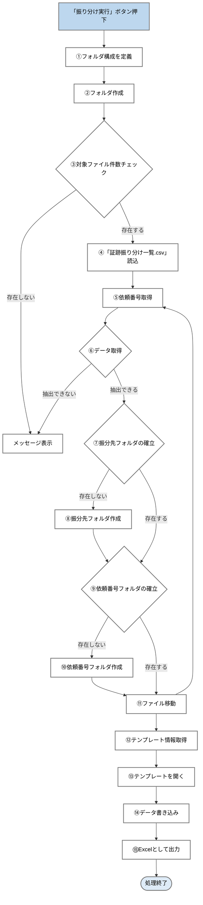

タブ4
振り分け実行

```mermaid
flowchart TB
    A[「振り分け実行」ボタン押下] --> B[①フォルダ構成を定義] --> C[②フォルダ作成] --> D{③対象ファイル件数チェック} -- 存在しない --> E[メッセージ表示]
    D{③対象ファイル件数チェック} -- 存在する --> F[④「証跡振り分け一覧.csv」読込] --> G[⑤依頼番号取得] --> H{⑥データ取得} --抽出できない--> E[メッセージ表示]
    H{⑥データ取得} --抽出できる--> I{⑦振分先フォルダの確立} -- 存在しない --> J[⑧振分先フォルダ作成] --> K{⑨依頼番号フォルダの確立}
    I{⑦振分先フォルダの確立} -- 存在する --> K{⑨依頼番号フォルダの確立} -- 存在しない -->  L[⑩依頼番号フォルダ作成] --> M[⑪ファイル移動]
    K{⑨依頼番号フォルダの確立} -- 存在する -->  M[⑪ファイル移動] --> G[⑤依頼番号取得]
    M[⑪ファイル移動] --> N[⑫テンプレート情報取得] --> O[⑬テンプレートを開く] --> P[⑭データ書き込み] --> Q[⑮Excelとして出力] --> R([処理終了])


    style A fill:#BDD7EE,stroke:#787878,stroke-width:2px,color:#000000
    style B fill:#FFFFFF,stroke:#787878,stroke-width:2px,color:#000000
    style C fill:#FFFFFF,stroke:#787878,stroke-width:2px,color:#000000
    style D fill:#FFFFFF,stroke:#787878,stroke-width:2px,color:#000000
    style E fill:#FFFFFF,stroke:#787878,stroke-width:2px,color:#000000
    style F fill:#FFFFFF,stroke:#787878,stroke-width:2px,color:#000000
    style G fill:#FFFFFF,stroke:#787878,stroke-width:2px,color:#000000
    style H fill:#FFFFFF,stroke:#787878,stroke-width:2px,color:#000000
    style I fill:#FFFFFF,stroke:#787878,stroke-width:2px,color:#000000
    style J fill:#FFFFFF,stroke:#787878,stroke-width:2px,color:#000000
    style K fill:#FFFFFF,stroke:#787878,stroke-width:2px,color:#000000
    style L fill:#FFFFFF,stroke:#787878,stroke-width:2px,color:#000000
    style M fill:#FFFFFF,stroke:#787878,stroke-width:2px,color:#000000
    style N fill:#FFFFFF,stroke:#787878,stroke-width:2px,color:#000000
    style O fill:#FFFFFF,stroke:#787878,stroke-width:2px,color:#000000
    style P fill:#FFFFFF,stroke:#787878,stroke-width:2px,color:#000000
    style Q fill:#FFFFFF,stroke:#787878,stroke-width:2px,color:#000000
    style R fill:#DEEBF7,stroke:#787878,stroke-width:2px,color:#000000
```