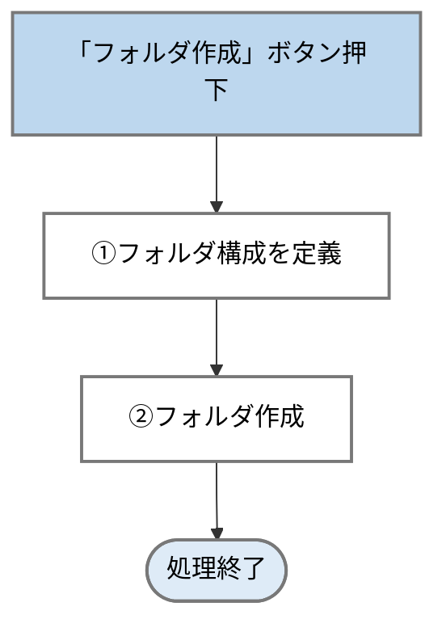
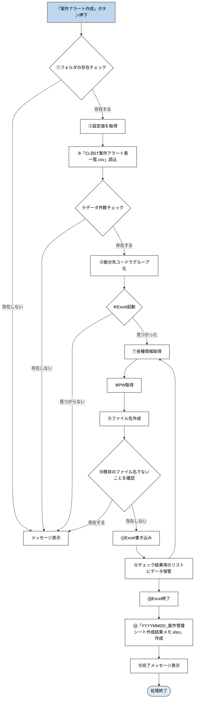
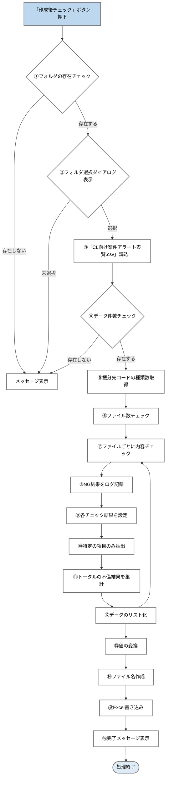
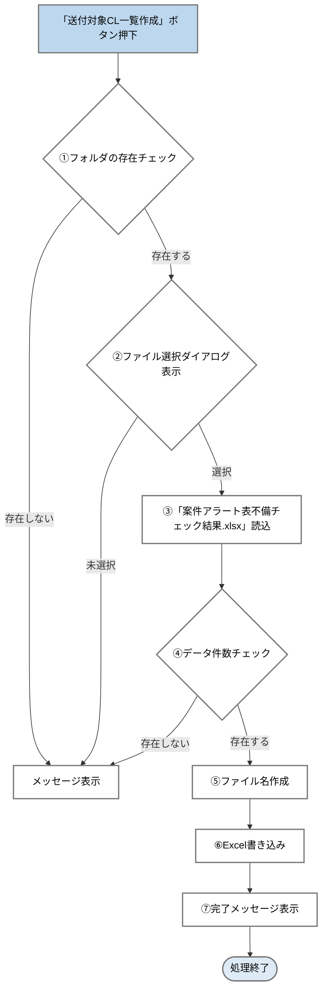

タブ5
案件アラート作成

```mermaid
flowchart TB
    A[「フォルダ作成」ボタン押下] --> B[①フォルダ構成を定義] --> C[②フォルダ作成] --> D([処理終了])

    style A fill:#BDD7EE,stroke:#787878,stroke-width:2px,color:#000000
    style B fill:#FFFFFF,stroke:#787878,stroke-width:2px,color:#000000
    style C fill:#FFFFFF,stroke:#787878,stroke-width:2px,color:#000000
    style D fill:#DEEBF7,stroke:#787878,stroke-width:2px,color:#000000
```

案件アラート作成

```mermaid
flowchart TB
    A[「案件アラート作成」ボタン押下] --> 
    B{①フォルダの存在チェック} -- 存在しない --> C[メッセージ表示]
    B{①フォルダの存在チェック} -- 存在する --> D[②設定値を取得] --> E[③「CL向け案件アラート表一覧.csv」読込] --> 
    F{④データ件数チェック} -- 存在しない --> C[メッセージ表示]
    F{④データ件数チェック} -- 存在する --> G[⑤振分先コードでグループ化] --> H{⑥Excel起動} -- 見つからない --> C[メッセージ表示]
    H{⑥Excel起動} -- 見つかった --> I[⑦各種情報取得] --> 
    J[⑧PW取得] --> K[⑨ファイル名作成] --> L{⑩既存のファイル名でないことを確認} -- 存在する --> C[メッセージ表示]
    L{⑩既存のファイル名でないことを確認} -- 存在しない --> M[⑪Excel書き込み] --> N[⑫チェック結果用のリストにデータ保管] --> I[⑦各種情報取得]
    N[⑫チェック結果用のリストにデータ保管] --> O[⑬Excel終了] --> P[⑭「YYYYMMDD_案件管理シート作成結果メモ.xlsx」作成] --> 
    Q[⑮完了メッセージ表示] --> R([処理終了])

    style A fill:#BDD7EE,stroke:#787878,stroke-width:2px,color:#000000
    style B fill:#FFFFFF,stroke:#787878,stroke-width:2px,color:#000000
    style C fill:#FFFFFF,stroke:#787878,stroke-width:2px,color:#000000
    style D fill:#FFFFFF,stroke:#787878,stroke-width:2px,color:#000000
    style E fill:#FFFFFF,stroke:#787878,stroke-width:2px,color:#000000
    style F fill:#FFFFFF,stroke:#787878,stroke-width:2px,color:#000000
    style G fill:#FFFFFF,stroke:#787878,stroke-width:2px,color:#000000
    style H fill:#FFFFFF,stroke:#787878,stroke-width:2px,color:#000000
    style I fill:#FFFFFF,stroke:#787878,stroke-width:2px,color:#000000
    style J fill:#FFFFFF,stroke:#787878,stroke-width:2px,color:#000000
    style K fill:#FFFFFF,stroke:#787878,stroke-width:2px,color:#000000
    style L fill:#FFFFFF,stroke:#787878,stroke-width:2px,color:#000000
    style M fill:#FFFFFF,stroke:#787878,stroke-width:2px,color:#000000
    style N fill:#FFFFFF,stroke:#787878,stroke-width:2px,color:#000000
    style O fill:#FFFFFF,stroke:#787878,stroke-width:2px,color:#000000
    style P fill:#FFFFFF,stroke:#787878,stroke-width:2px,color:#000000
    style Q fill:#FFFFFF,stroke:#787878,stroke-width:2px,color:#000000
    style R fill:#DEEBF7,stroke:#787878,stroke-width:2px,color:#000000
```

作成後チェック

```mermaid
flowchart TB
    A[「作成後チェック」ボタン押下] --> 
    B{①フォルダの存在チェック} -- 存在しない --> C[メッセージ表示]
    B{①フォルダの存在チェック} -- 存在する --> 
    D{②フォルダ選択ダイアログ表示} -- 未選択 --> C[メッセージ表示]
    D{②フォルダ選択ダイアログ表示} -- 選択 --> E[③「CL向け案件アラート表一覧.csv」読込] --> 
    F{④データ件数チェック} -- 存在しない --> C[メッセージ表示]
    F{④データ件数チェック} -- 存在する --> 
    G[⑤振分先コードの種類数取得] --> H[⑥ファイル数チェック] --> I[⑦ファイルごとに内容チェック] --> 
    J[⑧NG結果をログ記録] --> K[⑨各チェック結果を設定] --> L[⑩特定の項目のみ抽出] --> M[⑪トータルの不備結果を集計] --> 
    N[⑫データのリスト化] --> I[⑦ファイルごとに内容チェック]
    N[⑫データのリスト化] --> O[⑬値の変換] --> P[⑭ファイル名作成] --> Q[⑮Excel書き込み] --> R[⑯完了メッセージ表示] --> 
    S([処理終了])

    style A fill:#BDD7EE,stroke:#787878,stroke-width:2px,color:#000000
    style B fill:#FFFFFF,stroke:#787878,stroke-width:2px,color:#000000
    style C fill:#FFFFFF,stroke:#787878,stroke-width:2px,color:#000000
    style D fill:#FFFFFF,stroke:#787878,stroke-width:2px,color:#000000
    style E fill:#FFFFFF,stroke:#787878,stroke-width:2px,color:#000000
    style F fill:#FFFFFF,stroke:#787878,stroke-width:2px,color:#000000
    style G fill:#FFFFFF,stroke:#787878,stroke-width:2px,color:#000000
    style H fill:#FFFFFF,stroke:#787878,stroke-width:2px,color:#000000
    style I fill:#FFFFFF,stroke:#787878,stroke-width:2px,color:#000000
    style J fill:#FFFFFF,stroke:#787878,stroke-width:2px,color:#000000
    style K fill:#FFFFFF,stroke:#787878,stroke-width:2px,color:#000000
    style L fill:#FFFFFF,stroke:#787878,stroke-width:2px,color:#000000
    style M fill:#FFFFFF,stroke:#787878,stroke-width:2px,color:#000000
    style N fill:#FFFFFF,stroke:#787878,stroke-width:2px,color:#000000
    style O fill:#FFFFFF,stroke:#787878,stroke-width:2px,color:#000000
    style P fill:#FFFFFF,stroke:#787878,stroke-width:2px,color:#000000
    style Q fill:#FFFFFF,stroke:#787878,stroke-width:2px,color:#000000
    style R fill:#FFFFFF,stroke:#787878,stroke-width:2px,color:#000000
    style S fill:#DEEBF7,stroke:#787878,stroke-width:2px,color:#000000
```

送付対象CL一覧作成

```mermaid
flowchart TB
    A[「送付対象CL一覧作成」ボタン押下] --> 
    B{①フォルダの存在チェック} -- 存在しない --> C[メッセージ表示]
    B{①フォルダの存在チェック} -- 存在する --> 
    D{②ファイル選択ダイアログ表示} -- 未選択 --> C[メッセージ表示]
    D{②ファイル選択ダイアログ表示} -- 選択 --> E[③「案件アラート表不備チェック結果.xlsx」読込] --> 
    F{④データ件数チェック} -- 存在しない --> C[メッセージ表示]
    F{④データ件数チェック} -- 存在する --> G[⑤ファイル名作成] --> H[⑥Excel書き込み] --> I[⑦完了メッセージ表示] --> 
    J([処理終了])

    style A fill:#BDD7EE,stroke:#787878,stroke-width:2px,color:#000000
    style B fill:#FFFFFF,stroke:#787878,stroke-width:2px,color:#000000
    style C fill:#FFFFFF,stroke:#787878,stroke-width:2px,color:#000000
    style D fill:#FFFFFF,stroke:#787878,stroke-width:2px,color:#000000
    style E fill:#FFFFFF,stroke:#787878,stroke-width:2px,color:#000000
    style F fill:#FFFFFF,stroke:#787878,stroke-width:2px,color:#000000
    style G fill:#FFFFFF,stroke:#787878,stroke-width:2px,color:#000000
    style H fill:#FFFFFF,stroke:#787878,stroke-width:2px,color:#000000
    style I fill:#FFFFFF,stroke:#787878,stroke-width:2px,color:#000000
    style J fill:#DEEBF7,stroke:#787878,stroke-width:2px,color:#000000
```